# 🔄 AWS Cost Tracker - Workflow Documentation

## Overview

This document explains the complete workflow of the AWS Cost Tracker system, from initial deployment to daily operations and monitoring.

## 📋 Table of Contents

- [Deployment Workflow](#deployment-workflow)
- [Daily Operations Workflow](#daily-operations-workflow)
- [Cost Monitoring Workflow](#cost-monitoring-workflow)
- [Alert Management Workflow](#alert-management-workflow)
- [Emergency Response Workflow](#emergency-response-workflow)
- [Maintenance Workflow](#maintenance-workflow)

## 🚀 Deployment Workflow

### Phase 1: Infrastructure Setup

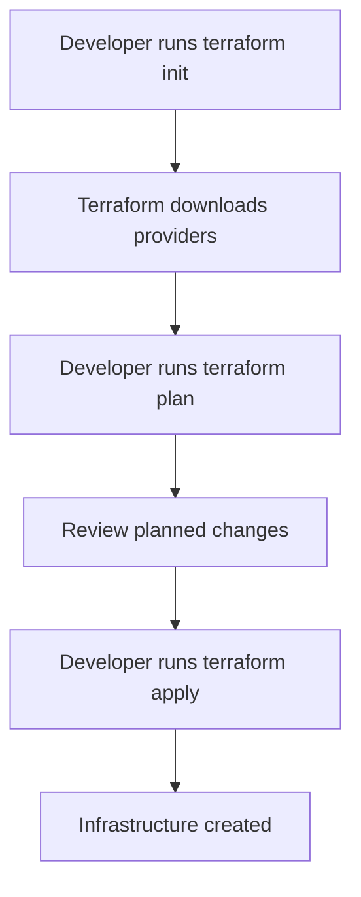

**Steps:**
1. **Initialize Terraform**
   ```bash
   terraform init
   ```

2. **Review Infrastructure Plan**
   ```bash
   terraform plan
   ```

3. **Deploy Infrastructure**
   ```bash
   terraform apply -auto-approve
   ```

4. **Verify Deployment**
   ```bash
   terraform output
   ```

### Phase 2: Application Deployment

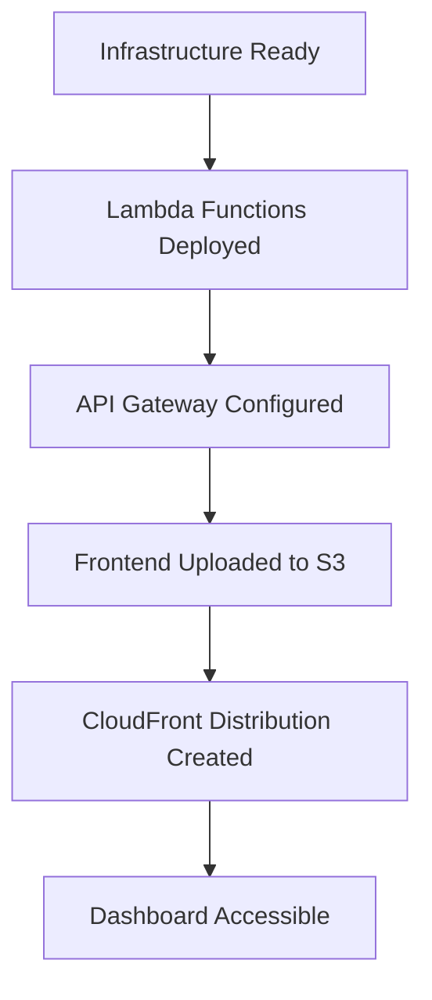

**Components Deployed:**
- ✅ Lambda Functions (API Handler, Cost Logger)
- ✅ API Gateway with CORS
- ✅ DynamoDB Table
- ✅ CloudWatch Alarms
- ✅ SNS Topic
- ✅ EventBridge Rule
- ✅ S3 Bucket with Static Website
- ✅ CloudFront Distribution

### Phase 3: Initial Configuration

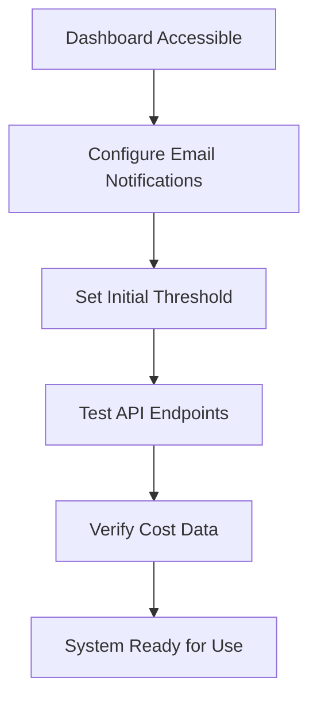

## 📊 Daily Operations Workflow

### Morning Routine (Automated)

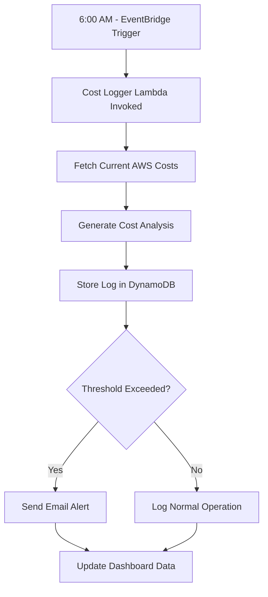

**Automated Tasks:**
- **06:00 AM**: Cost monitoring check
- **12:00 PM**: Midday cost review
- **06:00 PM**: Evening cost summary
- **12:00 AM**: End-of-day cost analysis

### User Dashboard Workflow

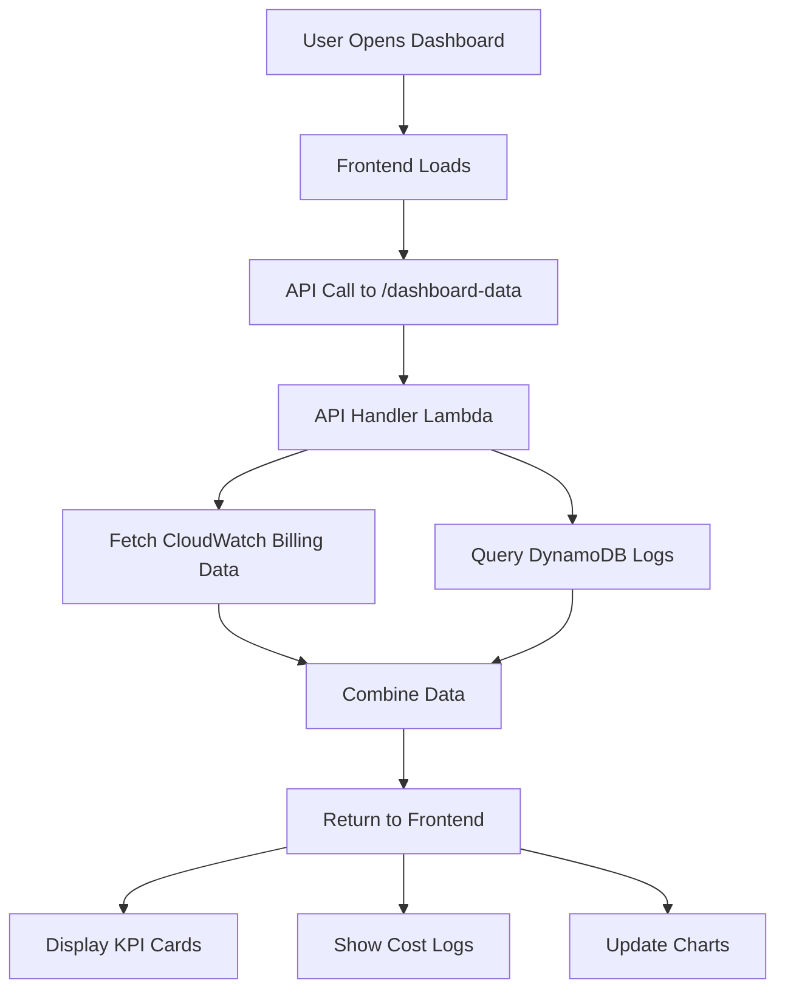

**Dashboard Features:**
- **Real-time Data**: Current month spending
- **KPI Cards**: Spend, forecast, highest service, threshold
- **Cost Logs**: Recent monitoring events
- **Settings Panel**: Threshold configuration
- **Emergency Controls**: EC2 stop functionality

## 💰 Cost Monitoring Workflow

### Real-Time Cost Tracking

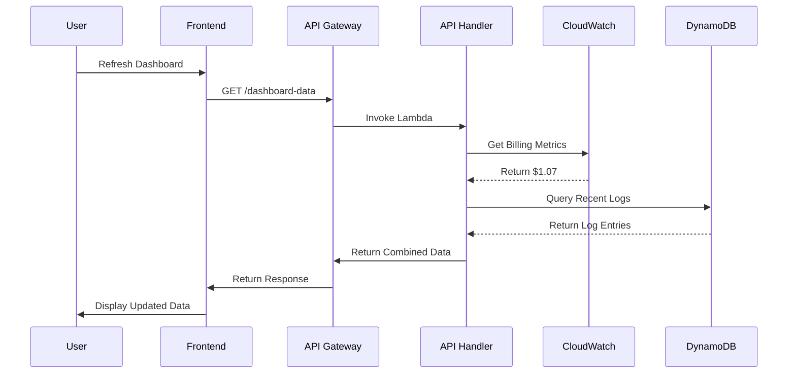

### Cost Data Sources

1. **Primary Source - CloudWatch Billing**
   - Real-time cost metrics
   - Updated every few hours
   - Matches AWS Console data

2. **Fallback Source - Cost Explorer API**
   - Detailed service breakdown
   - 24-48 hour delay
   - More comprehensive data

### Cost Analysis Process

```python
def analyze_costs():
    # 1. Get current spending
    current_spend = get_cloudwatch_billing()
    
    # 2. Calculate forecast
    forecast = current_spend * 1.2  # 20% increase
    
    # 3. Find highest cost service
    services = get_cost_explorer_breakdown()
    highest_service = max(services, key=lambda x: x['cost'])
    
    # 4. Check threshold
    if current_spend > threshold:
        send_alert(current_spend, threshold)
    
    # 5. Store analysis
    store_cost_analysis(current_spend, forecast, highest_service)
```

## 🚨 Alert Management Workflow

### Threshold Breach Detection

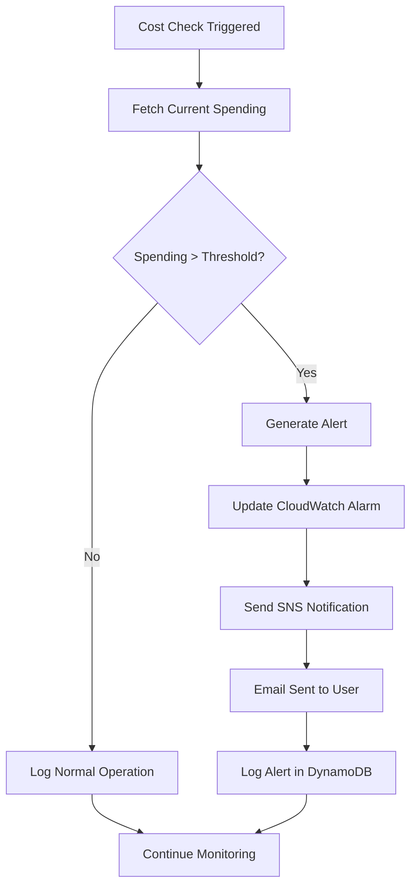

### Alert Types

1. **Threshold Breach Alert**
   - **Trigger**: Spending exceeds configured threshold
   - **Action**: Email notification + CloudWatch alarm
   - **Content**: Current spend, threshold, recommendations

2. **Anomaly Detection Alert**
   - **Trigger**: Unusual spending patterns
   - **Action**: Email notification
   - **Content**: Anomaly details, historical comparison

3. **Service-Specific Alert**
   - **Trigger**: High cost from specific AWS service
   - **Action**: Email notification
   - **Content**: Service details, cost breakdown

### Email Alert Content

```json
{
  "subject": "AWS Cost Alert - Threshold Exceeded",
  "body": {
    "current_spend": "$1.07",
    "threshold": "$0.03",
    "excess": "$1.04",
    "highest_service": "AWS Lambda",
    "recommendations": [
      "Review Lambda function usage",
      "Consider reserved capacity",
      "Check for idle resources"
    ],
    "dashboard_url": "https://dat5ebqhkbl9j.cloudfront.net"
  }
}
```

## 🆘 Emergency Response Workflow

### Emergency Stop Process

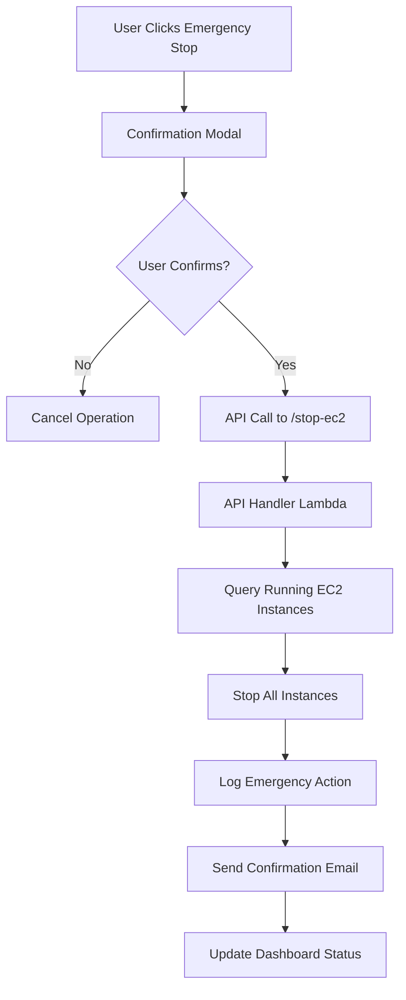

### Emergency Stop Features

- **One-Click Stop**: Immediate EC2 instance termination
- **Confirmation Required**: Prevents accidental stops
- **Audit Trail**: All actions logged in DynamoDB
- **Email Notification**: Confirmation sent to user
- **Status Updates**: Real-time dashboard updates

### Emergency Response Checklist

1. **Immediate Actions**
   - [ ] Click Emergency Stop button
   - [ ] Confirm action in modal
   - [ ] Verify instances stopped
   - [ ] Check email confirmation

2. **Follow-up Actions**
   - [ ] Review cost impact
   - [ ] Investigate cause of high costs
   - [ ] Adjust thresholds if needed
   - [ ] Restart instances when appropriate

## 🔧 Maintenance Workflow

### Weekly Maintenance

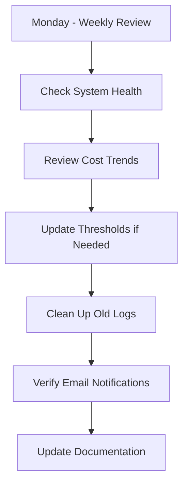

### Monthly Maintenance

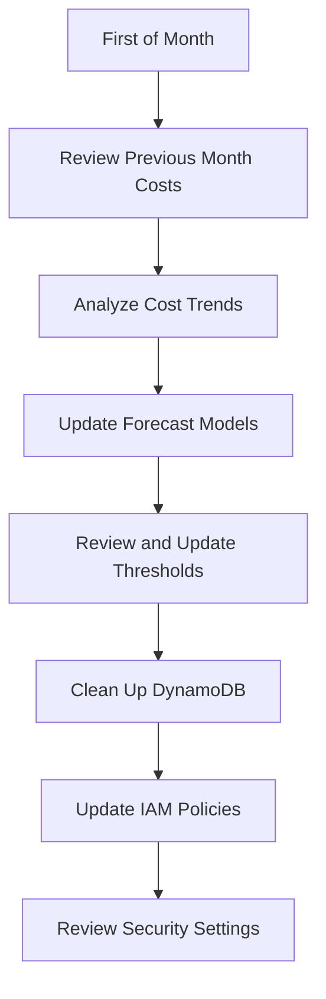

### Maintenance Tasks

#### Daily Tasks
- **Monitor Dashboard**: Check for alerts and errors
- **Review Logs**: Ensure system is functioning properly
- **Cost Verification**: Confirm data accuracy

#### Weekly Tasks
- **Threshold Review**: Adjust based on spending patterns
- **Log Cleanup**: Remove old DynamoDB entries
- **Performance Check**: Review Lambda execution times

#### Monthly Tasks
- **Cost Analysis**: Deep dive into spending patterns
- **Security Review**: Check IAM permissions
- **Backup Verification**: Ensure data is backed up
- **Documentation Update**: Keep docs current

## 📈 Performance Monitoring Workflow

### System Health Checks

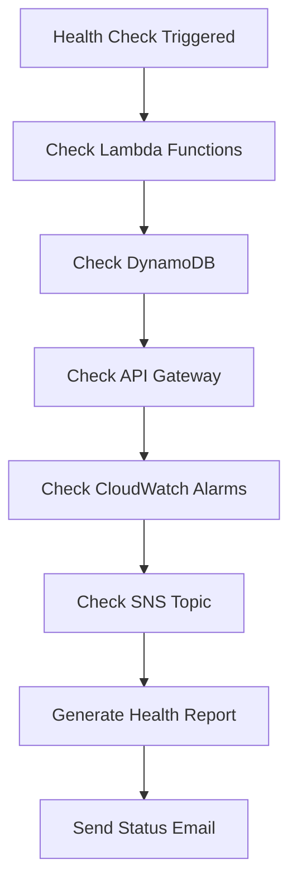

### Performance Metrics

1. **Lambda Performance**
   - Execution duration
   - Error rate
   - Memory usage
   - Cold start frequency

2. **API Gateway Performance**
   - Request latency
   - 4XX/5XX error rate
   - Cache hit rate
   - Request count

3. **DynamoDB Performance**
   - Read/Write capacity usage
   - Throttled requests
   - Item count
   - Query latency

4. **Cost Monitoring Performance**
   - Data freshness
   - Alert accuracy
   - Forecast precision
   - Log completeness

## 🔄 Continuous Improvement Workflow

### Feedback Loop

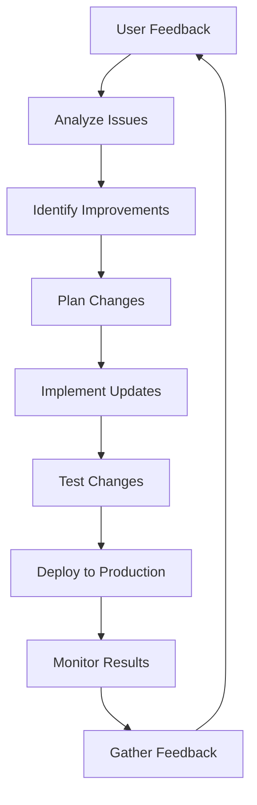

### Improvement Areas

1. **Cost Accuracy**
   - Better data sources
   - Improved forecasting
   - Real-time updates

2. **User Experience**
   - UI/UX improvements
   - Performance optimization
   - Mobile responsiveness

3. **System Reliability**
   - Error handling
   - Fallback mechanisms
   - Monitoring improvements

4. **Security**
   - Access controls
   - Data encryption
   - Audit logging

---

## 📋 Workflow Summary

The AWS Cost Tracker workflow is designed to be:

- **Automated**: Minimal manual intervention required
- **Reliable**: Multiple fallback mechanisms
- **Scalable**: Handles increasing load automatically
- **Cost-Effective**: Pay-per-use pricing model
- **User-Friendly**: Intuitive dashboard and controls
- **Maintainable**: Clear processes and documentation

**Key Workflow Benefits:**
- ✅ **24/7 Automated Monitoring**
- ✅ **Real-time Cost Tracking**
- ✅ **Proactive Alert Management**
- ✅ **Emergency Response Capabilities**
- ✅ **Continuous System Improvement**
- ✅ **Comprehensive Audit Trail**


