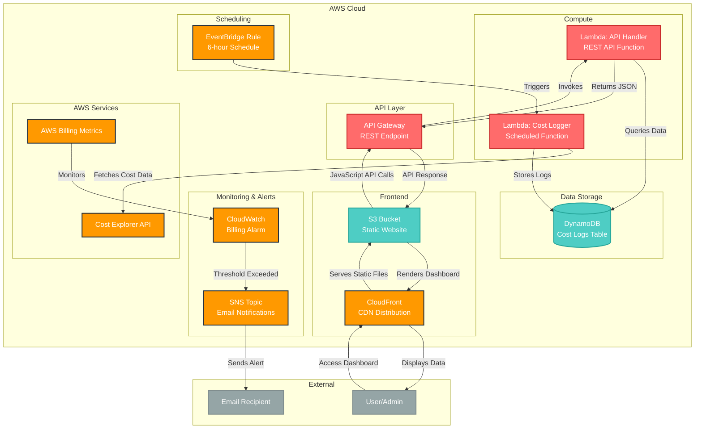

# Cloud Cost Tracker & Alert System - Architecture

## System Architecture Diagram

## Component Descriptions

### Core Components

1. **DynamoDB Table** (`cost_logs`)
   - Stores cost and usage logs with timestamp as primary key
   - Pay-per-request billing mode for cost efficiency
   - Contains monthly cost data, service breakdowns, and metadata

2. **Lambda Functions**
   - **Cost Logger**: Scheduled function that fetches cost data from Cost Explorer API and stores it in DynamoDB
   - **API Handler**: Handles REST API requests to retrieve cost data from DynamoDB

3. **EventBridge Rule**
   - Triggers the cost logger Lambda function on a schedule (default: every 6 hours)
   - Configurable via Terraform variables

4. **CloudWatch Alarm**
   - Monitors AWS billing metrics for cost threshold breaches
   - Triggers SNS notifications when threshold is exceeded

5. **SNS Topic & Subscription**
   - Sends email notifications when cost thresholds are exceeded
   - Configurable email endpoint

### API Layer

6. **API Gateway**
   - Provides RESTful API endpoint for cost data access
   - Handles CORS for web dashboard integration
   - Integrates with Lambda API handler

### Frontend

7. **S3 Bucket**
   - Hosts static HTML dashboard files
   - Configured for website hosting with public read access

8. **CloudFront Distribution**
   - CDN for fast global access to the dashboard
   - Handles HTTPS and custom error pages for SPA routing

## Data Flow

### Cost Logging Flow
1. EventBridge triggers cost logger Lambda every 6 hours
2. Lambda calls AWS Cost Explorer API to fetch current month's cost data
3. Cost data is processed and stored in DynamoDB with timestamp
4. CloudWatch monitors billing metrics continuously
5. When threshold exceeded, SNS sends email alert

### Dashboard Access Flow
1. User accesses CloudFront URL
2. CloudFront serves static HTML from S3
3. JavaScript in HTML makes API calls to API Gateway
4. API Gateway invokes Lambda API handler
5. Lambda queries DynamoDB for cost logs
6. Data is returned and displayed in interactive dashboard

## Security Considerations

- IAM roles with least privilege access
- S3 bucket policies for public read access to static content only
- API Gateway with no authentication (can be enhanced with API keys or Cognito)
- Lambda functions have minimal required permissions
- CloudWatch alarms for monitoring and alerting

## Scalability Features

- DynamoDB auto-scaling with pay-per-request billing
- Lambda functions scale automatically
- CloudFront CDN for global distribution
- S3 static hosting for high availability
- EventBridge for reliable scheduling

## Cost Optimization

- DynamoDB on-demand billing
- Lambda functions with appropriate timeouts
- CloudFront caching to reduce origin requests
- S3 standard storage class
- EventBridge free tier usage
